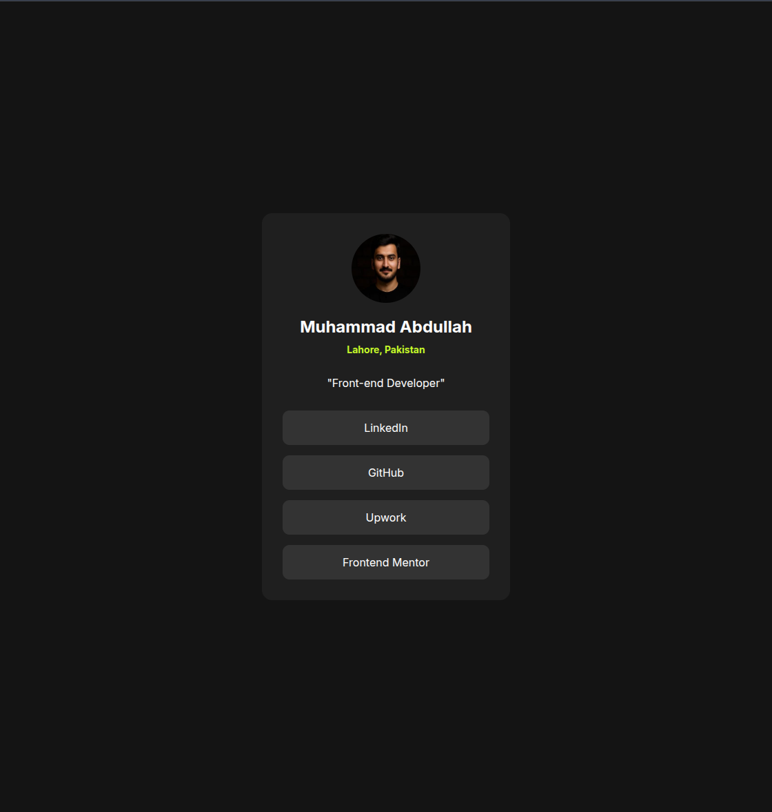
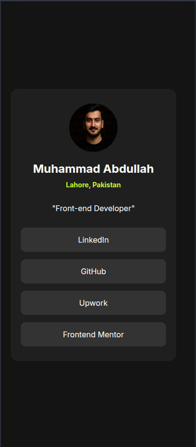

# Frontend Mentor - Social links profile solution

This is my solution to the [Social links profile challenge on Frontend Mentor](https://www.frontendmentor.io/challenges/social-links-profile-UG32l9m6dQ).

## Overview

### The challenge

Users should be able to:

- See hover states for all interactive elements on the page

### Screenshot

### Links

- Solution URL: [Frontend Mentor Profile](https://www.frontendmentor.io/profile/theprogrammer141)
- Live Site URL:

## My process

### Built with

- Semantic HTML5 markup
- CSS
- Flexbox
- Responsive design with a media query
- Google Fonts (Inter)

### What I learned

- How to structure a small profile card using semantic HTML elements.
- How to center content vertically and horizontally using Flexbox.
- How to style interactive links with hover effects.
- How to make the card adapt better on smaller screens.

### Continued development

- Add clear keyboard focus styles for better accessibility.
- Improve spacing and sizing with `rem` units for more scalable layouts.
- Deploy the project live and add the production URL.

### Useful resources

- [MDN Web Docs - Flexbox](https://developer.mozilla.org/en-US/docs/Learn/CSS/CSS_layout/Flexbox) - Helped me understand layout alignment and spacing.
- [Frontend Mentor](https://www.frontendmentor.io) - Great platform for practicing real frontend projects.

## Author

- Name: Muhammad Abdullah
- Frontend Mentor: [@theprogrammer141](https://www.frontendmentor.io/profile/theprogrammer141)
- GitHub: [@theprogrammer141](https://github.com/theprogrammer141)
- LinkedIn: [Muhammad Abdullah](https://www.linkedin.com/in/muhammad-abdullah-872b74278/)
